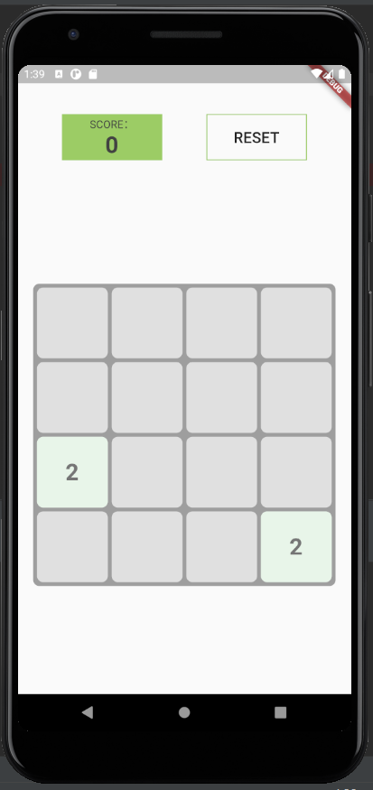
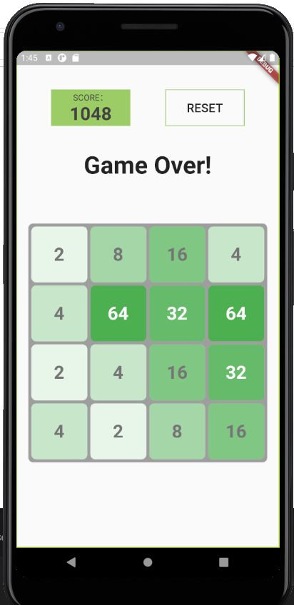

# 2048-Clone</h3>
### Mô tả</h4>
- Xây dựng trò chơi 2048 sử dụng Flutter.

### Cách chơi: 
- 2048 chơi trên một lưới vuông 4×4. Mỗi lần di chuyển là một lượt, người chơi sử dụng các phím mũi tên và các khối vuông sẽ trượt theo một trong bốn hướng tương ứng (lên, xuống, trái, phải). Mỗi lượt có một khối có giá trị 2 hoặc 4 sẽ xuất hiện ngẫu nhiên ở một ô trống trên lưới. Các khối vuông trượt theo hướng chỉ định cho đến khi chạm đến biên của lưới hoặc chạm vào khối vuông khác. Nếu hai khối vuông có cùng giá trị chạm vào nhau, chúng sẽ kết hợp lại thành một khối vuông có giá trị bằng tổng giá trị hai khối vuông đó (giá trị gấp đôi). Khối vuông kết quả không thể kết hợp với khối vuông khác một lần nữa trong một lượt di chuyển. Để dễ nhận biết thì các khối vuông giá trị khác nhau sẽ có màu sắc khác nhau. 
- Bảng điểm ở góc trên bên phải cho biết điểm của người chơi. Ban đầu điểm bằng 0. Khi hai khối vuông kết hợp thì người chơi sẽ tăng điểm là giá trị khối vuông mới. Bên cạnh điểm hiện tại là kỉ lục điểm cao nhất người chơi từng đạt được. 
- Khi người chơi tạo được ô vuông có giá trị 2048 thì thắng cuộc. Lúc này người chơi có thể lựa chọn tiếp tục chơi để đạt các giá trị cao hơn 2048. Khi không còn nước đi hợp lệ (không còn ô trống và các ô kề nhau đều khác giá trị) thì trò chơi kết thúc.

### Chức năng xây dựng được:
- Trò chơi hoạt động được.
- Tính điểm.
- Khởi động lại trò chơi.
### Demo:  

### Thông tin sinh viên
* Họ tên: Nguyễn Quỳnh Mai
* MSSV: 17021292

